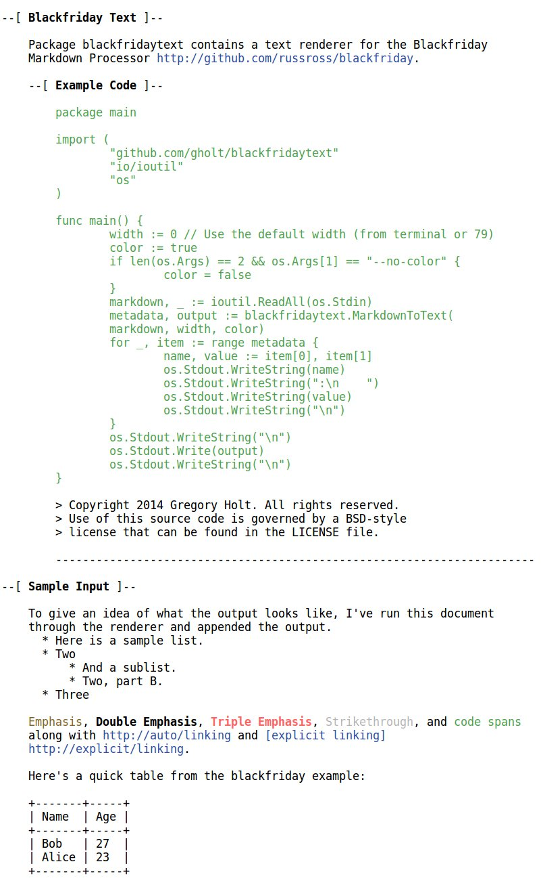

# Blackfriday Text

Package blackfridaytext contains a text renderer for the Blackfriday Markdown
Processor http://github.com/russross/blackfriday.

## Example Code

```go
package main

import (
	"github.com/gholt/blackfridaytext"
	"io/ioutil"
	"os"
)

func main() {
	markdown, _ := ioutil.ReadAll(os.Stdin)
	metadata, output := blackfridaytext.MarkdownToText(markdown, nil)
	for _, item := range metadata {
		name, value := item[0], item[1]
		os.Stdout.WriteString(name)
		os.Stdout.WriteString(":\n    ")
		os.Stdout.WriteString(value)
		os.Stdout.WriteString("\n")
	}
	os.Stdout.WriteString("\n")
	os.Stdout.Write(output)
	os.Stdout.WriteString("\n")
}
```

> Copyright 2014 Gregory Holt. All rights reserved.  
> Use of this source code is governed by a BSD-style  
> license that can be found in the LICENSE file.

---

# Sample Input

To give an idea of what the output looks like, I've run this document through
the renderer and appended the output.

 *  Here is a sample list.
 *  Two
     *  And a sublist.
     *  Two, part B.
 *  Three

*Emphasis*, **Double Emphasis**, ***Triple Emphasis***, ~~Strikethrough~~, and `code spans` along with http://auto/linking and [explicit linking](http://explicit/linking).

Here's a quick table from the blackfriday example:

Name  | Age
------|----
Bob   | 27
Alice | 23

# No Color Output

```
--[ Blackfriday Text ]--

    Package blackfridaytext contains a text renderer for the Blackfriday
    Markdown Processor http://github.com/russross/blackfriday.

    --[ Example Code ]--

        package main

        import (
            "github.com/gholt/blackfridaytext"
            "io/ioutil"
            "os"
        )

        func main() {
            width := 0 // Use the default width (from terminal or 79)
            color := true
            if len(os.Args) == 2 && os.Args[1] == "--no-color" {
                color = false
            }
            markdown, _ := ioutil.ReadAll(os.Stdin)
            metadata, output := blackfridaytext.MarkdownToText(
                markdown, width, color)
            for _, item := range metadata {
                name, value := item[0], item[1]
                os.Stdout.WriteString(name)
                os.Stdout.WriteString(":\n    ")
                os.Stdout.WriteString(value)
                os.Stdout.WriteString("\n")
            }
            os.Stdout.WriteString("\n")
            os.Stdout.Write(output)
            os.Stdout.WriteString("\n")
        }

        > Copyright 2014 Gregory Holt. All rights reserved.
        > Use of this source code is governed by a BSD-style
        > license that can be found in the LICENSE file.

        -----------------------------------------------------------------------

--[ Sample Input ]--

    To give an idea of what the output looks like, I've run this document
    through the renderer and appended the output.
      * Here is a sample list.
      * Two
          * And a sublist.
          * Two, part B.
      * Three

    *Emphasis*, **Double Emphasis**, ***Triple Emphasis***, ~~Strikethrough~~,
    and "code spans" along with http://auto/linking and [explicit linking]
    http://explicit/linking.

    Here's a quick table from the blackfriday example:

    +-------+-----+
    | Name  | Age |
    +-------+-----+
    | Bob   | 27  |
    | Alice | 23  |
    +-------+-----+
```

# Color Output


